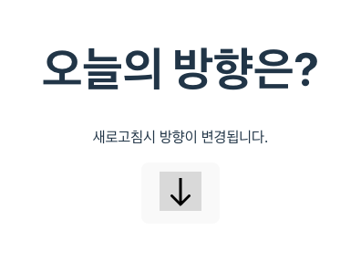
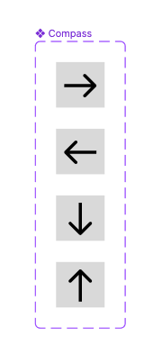
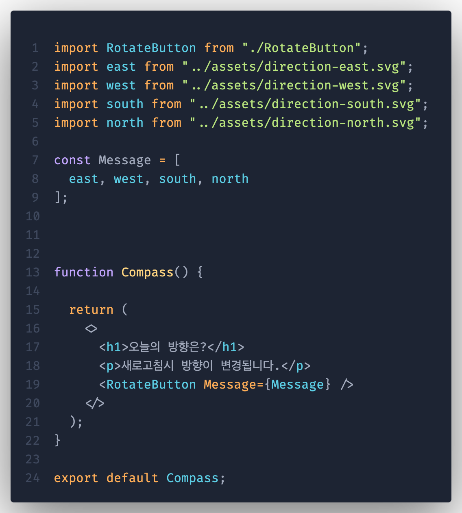
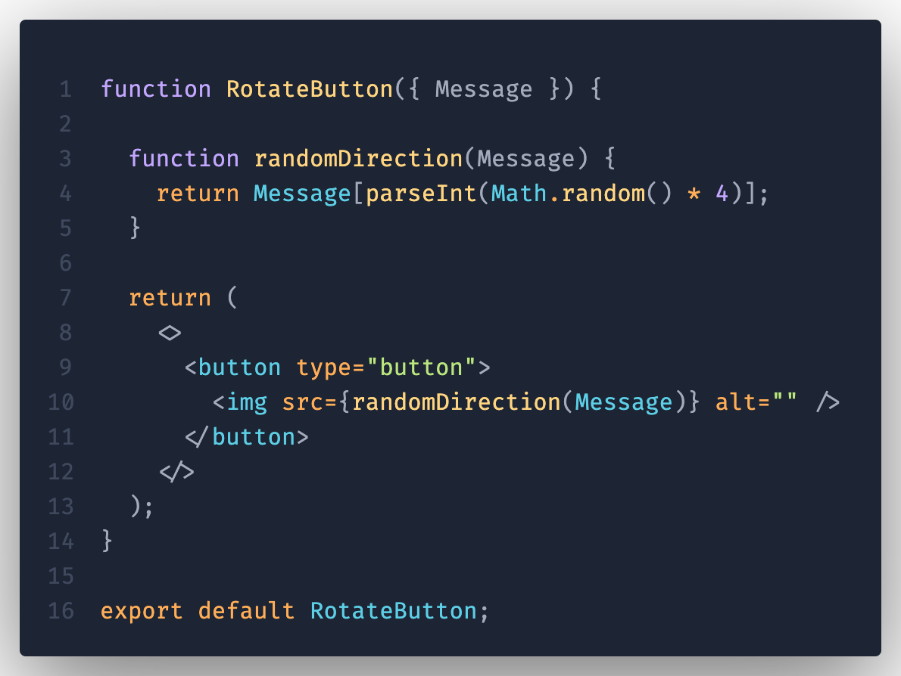

# 1주차 React 과제

## 구현 화면

## 피그마 시안

- [Figma 링크](https://www.figma.com/file/JjL54OkneUNzru41btJpFt/Compass?type=design&node-id=0%3A1&mode=design&t=AFodwjJgPgUVXZ0Q-1)

- 각각 버튼에 variant로 Direction을 설정하였습니다.

## 파일 구조

    src
    ├── App.css
    ├── App.jsx
    ├── assets
    │   ├── compass2.png
    │   ├── direction-east.svg
    │   ├── direction-north.svg
    │   ├── direction-south.svg
    │   └── direction-west.svg
    ├── components
    │   ├── Compass.jsx
    │   └── RotateButton.jsx
    ├── index.css
    └── main.jsx

## 코드

#### Compass.jsx

#### randomDirection.jsx

